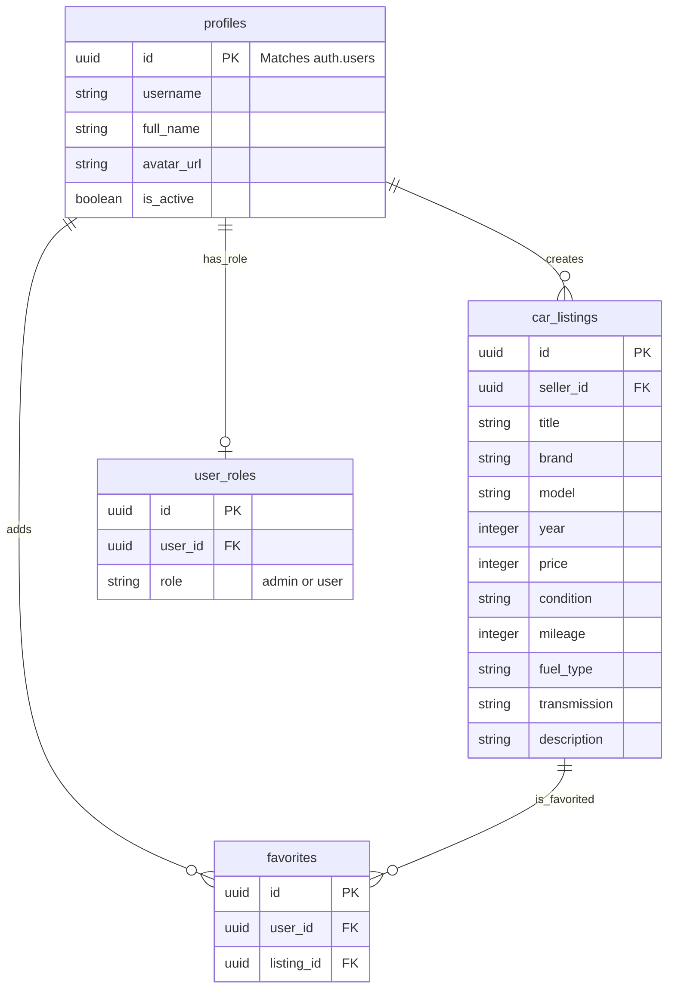

# AutoMarket AI

AutoMarket AI is a premium, multi-page car marketplace web application built for the SoftUni capstone project. 
It allows users to publish, edit, and browse car listings with a sleek, modern UI.

## Features
- **User Authentication**: Secure signup and login powered by Supabase Auth.
- **Car Listings**: Create, edit, and delete car listings with a rich interface.
- **Favorites**: Users can save their favorite listings.
- **PDF Generation**: View and download car listings as formatted PDF documents.
- **Image Gallery**: Upload and view multiple images for each listing.
- **Admin Dashboard**: Comprehensive control center for managing users, listings, and platform health.

## Technologies Used
- **Frontend**: HTML5, CSS3, Bootstrap 5, Vanilla JavaScript, Vite
- **Backend & Database**: Supabase (PostgreSQL Database, Authentication, Storage)
- **Deployment**: Configured for Netlify (`netlify.toml` included)

## Setup Instructions

1. **Clone the repository**
2. **Install dependencies**: 
   ```bash
   npm install
   ```
3. **Environment Variables**:
   Create a `.env` file in the root directory based on `.env.example`:
   ```
   VITE_SUPABASE_URL=your_supabase_project_url
   VITE_SUPABASE_ANON_KEY=your_supabase_anon_key
   ```
4. **Start development server**: 
   ```bash
   npm run dev
   ```
5. **Build for production**: 
   ```bash
   npm run build
   ```

## Database Schema (ER Diagram)



## Sample Accounts for Review
Use the following demo accounts to explore different features of the application.

### Administrator Account
- **Email**: `admin@automarket.com`
- **Password**: `admin123456`
- **Role**: Has access to the Admin Control Center to manage users and delete any listing.

### Standard User Account
- **Email**: `user@automarket.com`
- **Password**: `user123456`
- **Role**: Can create listings, save favorites, and manage their own profile.