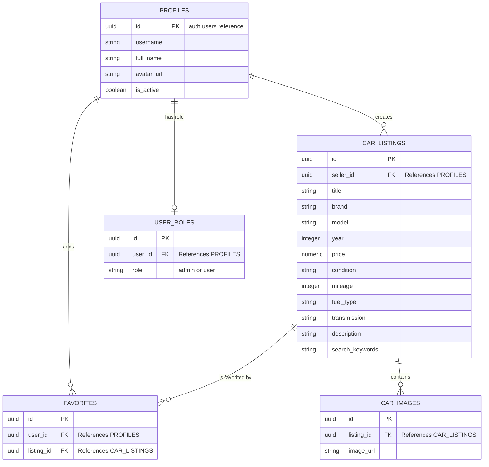

# AutoMarket AI

AutoMarket AI is a premium, multi-page car marketplace web application built for the SoftUni capstone project. 
It allows users to publish, edit, and browse car listings with a sleek, modern UI.

## Features
- **User Authentication**: Secure signup and login powered by Supabase Auth.
- **Car Listings**: Create, edit, and delete car listings with a rich interface.
- **Favorites**: Users can save their favorite listings.
- **PDF Generation**: View and download car listings as formatted PDF documents.
- **Image Gallery**: Upload and view multiple images for each listing.
- **Admin Dashboard**: Comprehensive control center for managing users, listings, and platform health.

## Technologies Used
- **Frontend**: HTML5, CSS3, Bootstrap 5, Vanilla JavaScript, Vite
- **Backend & Database**: Supabase (PostgreSQL Database, Authentication, Storage)
- **Deployment**: Configured for Netlify (`netlify.toml` included)

## 📝 Project Description
AutoMarket AI is a premium, modern single-page car marketplace web application. It leverages artificial intelligence (via Google Gemini API) to streamline the process of creating car listings by auto-extracting specifications from text and generating SEO-optimized titles, descriptions, and keywords. 

**User Roles & Permissions:**
- **Guests (Unauthenticated Users)**: Can browse the home page, search for cars, and view listing details.
- **Registered Users**: Can create, edit, and delete their own car listings. They can upload multiple images, use AI to generate descriptions, and save favorite listings to their profile.
- **Administrators**: Have access to a dedicated Admin Control Center where they can manage all users (suspend/activate), moderate platform content (delete any listing), and view platform statistics.

## 🏗️ Architecture & Technologies Used
- **Front-end**: 
  - **HTML5 & CSS3**: Custom responsive styling with advanced UI elements (glassmorphism, animations).
  - **Vanilla JavaScript (ES Modules)**: Component-based architecture without heavy frameworks.
  - **Bootstrap 5**: Used for rapid layout structuring and grid system.
  - **Vite**: Ultra-fast build tool and development server.
- **Back-end (BaaS)**: 
  - **Supabase**: Handles backend logic without managing a custom server.
    - **Authentication**: JWT-based secure user sessions.
    - **PostgreSQL Database**: Relational data storage with Row Level Security (RLS).
    - **Storage**: Scalable storage buckets for car images and avatars.
- **AI Integration**:
  - **Google Gemini API**: Utilized for automated data extraction, title generation, and SEO keywords.

## 🗄️ Database Schema Design
The application utilizes a PostgreSQL database structured around five main entities. Row Level Security (RLS) is enabled on all tables to ensure users can only modify their own data.



- **`PROFILES`** acts as the central user entity, linking securely to Supabase's internal `auth.users` system via the `id` field.
- **`USER_ROLES`** provides Role-Based Access Control (RBAC), determining whether a profile has standard user or administrator privileges.
- **`FAVORITES`** serves as a junction table to handle the Many-to-Many relationship between users and the cars they save.

## Sample Accounts for Review
Use the following demo accounts to explore different features of the application.

### Administrator Account
- **Email**: `admin@automarket.com`
- **Password**: `admin123456`
- **Role**: Has access to the Admin Control Center to manage users and delete any listing.

### Standard User Account
- **Email**: `user@automarket.com`
- **Password**: `user123456`
- **Role**: Can create listings, save favorites, and manage their own profile.

## 🛠️ Local Development Setup Guide
Follow these steps to run AutoMarket AI locally on your machine:

1. **Clone the repository:**
   ```bash
   git clone <your-repo-url>
   cd auto-market
   ```
2. **Install dependencies:**
   Make sure you have Node.js installed, then run:
   ```bash
   npm install
   ```
3. **Environment Configuration:**
   Create a `.env` file in the root directory and add your Supabase credentials and Gemini API key:
   ```env
   VITE_SUPABASE_URL=your_supabase_project_url
   VITE_SUPABASE_ANON_KEY=your_supabase_anon_key
   VITE_GEMINI_API_KEY=your_gemini_api_key
   ```
4. **Start the Development Server:**
   ```bash
   npm run dev
   ```
   *The app will be available at `http://localhost:5173`.*
5. **Build for Production:**
   ```bash
   npm run build
   ```

## 📂 Key Folders and Files
- `/public`: Contains static public assets (e.g., favicon, generated mock images).
- `/src`: The core source code of the application.
  - `/src/pages`: Contains all page modules. Each folder (e.g., `home`, `browse`, `create`, `admin`) houses the JS logic for rendering and interacting with that specific page.
  - `/src/components`: Reusable UI components like the Navbar, Footer, Image Gallery, and Listing Cards.
  - `/src/services`: Handles all external API and backend communications.
    - `supabase.js`: Initializes the Supabase client.
    - `authService.js`: Handles user registration, login, and sessions.
    - `listingService.js`: CRUD operations for car listings.
    - `aiService.js`: Prompts and logic for the Gemini AI integration.
  - `/src/styles`: Global CSS variables and utility classes (`main.css`, `variables.css`).
  - `/src/utils`: Helper functions.
    - `router.js`: Custom client-side hash router implementation.
    - `themeService.js`: Manages the Light/Dark/Auto theme switching.
- `index.html`: The main entry point of the Single Page Application.
- `main.js`: Initializes the app, router, and authentication state on startup.
- `vite.config.js`: Configuration for the Vite bundler.
